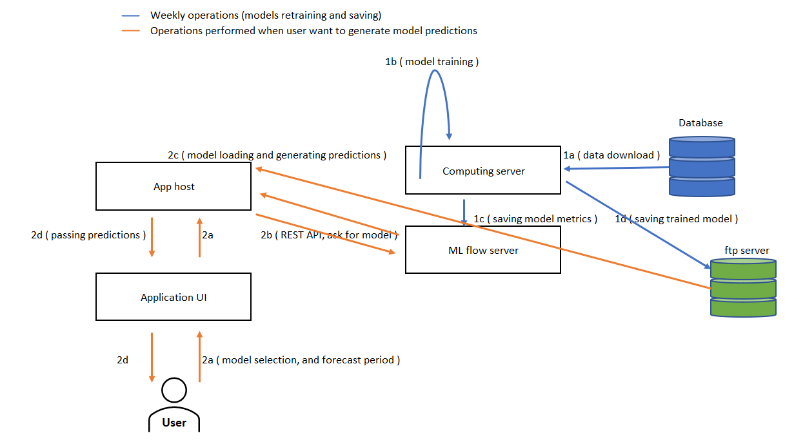

## GPW Stock Exchange Analytics app

Main purpose of this project is to:  

 
<li> provide easy access to stock prices (although those can be checked on sites like bankier.pl or stooq.com or gpw.pl, from here those can be downloaded easily)</li>  

<li> suggest the direction in which stock price will move (but please don't make any financial decision based on this prediction alone)</li>  

<li> create a connection with local DB to receive daily updates of stock prices (upload usulally takes place around 23)</li>  

 

<h3> Architecture </h3> 
 
<li> <strong>Database connection module</strong>: Functionality to add and remove connection string, after adding it app provides daily updates of stock prices directly to all databases registered </li>  

<li> <strong>Raw Data download module</strong>: Functionality to download stock prices for a selected period of time </li>  

<li> <strong>Analytics module</strong>: Functionalities to plot dashboards containing financial data for a selected company and to perform Time series modelling, below is presented schema how does predictions are made:</li>

 
<strong>Currently implemented models:</strong>  

- Holt-Winters Exponential Smoothing model  

 

<h3>  CI CD </h3>
 

After Pull Request to main branch is completed, server will automatically detect changes and reboot application, it usually takes around 8 minutes for container to be build and set up 